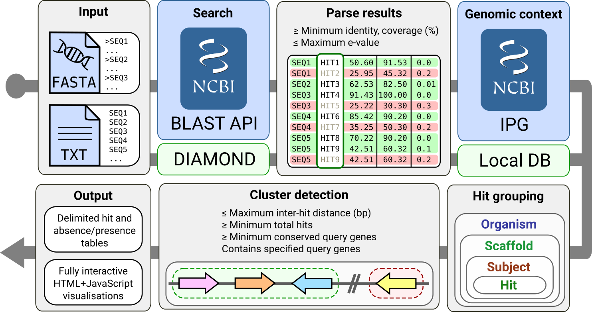
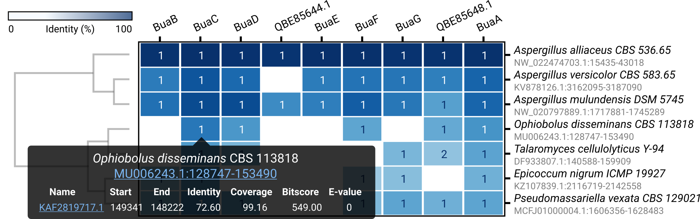

# cblaster
[](https://github.com/gamcil/cblaster/actions/workflows/pythonapp.yml)
[](https://codecov.io/gh/gamcil/cblaster)
[](https://opensource.org/licenses/MIT)
[](https://badge.fury.io/py/cblaster)
[](https://cblaster.readthedocs.io/en/latest/?badge=latest)
[](https://doi.org/10.5281/zenodo.3660769)

## Outline

`cblaster` is a tool for finding clusters of co-located homologous sequences
in BLAST searches.



Given a collection of protein sequences, `cblaster` can search sequence databases
remotely (via NCBI BLAST API) or locally (via `DIAMOND`). Search results are parsed
and filtered based on user thresholds for identity, coverage and e-value. The genomic
coordinates of remaining hits are obtained from the NCBI's Identical Protein
Group (IPG) database (or a local database in local searches). Finally,
`cblaster` scans for instances of collocation and generates visualisations:



## Installation
`cblaster` can be installed via pip:

```bash
$ pip3 install cblaster --user
```

or by cloning the repository and installing:

```bash
$ git clone https://github.com/gamcil/cblaster.git
...
$ cd cblaster/
$ pip3 install .
```

## Dependencies
`cblaster` is tested on Python 3.6, and its only external Python dependency is
the `requests` module (used for interaction with NCBI APIs).
If you want to perform local searches, you should have `diamond` installed and available
on your system $PATH.
`cblaster` will throw an error if a local search is started but it cannot find
`diamond` or `diamond-aligner` (alias when installed via apt) on the system.

## Usage
`cblaster` accepts FASTA files and collections of valid NCBI sequence identifiers
(GIs, accession numbers) as input.
A remote search can be performed as simply as:

```bash
$ cblaster search --query_file query.fasta
```

For example, to remotely search the
[burnettramic acids gene cluster, *bua*](https://pubs.acs.org/doi/10.1021/acs.orglett.8b04042)
, against the NCBI's nr database:

```bash
$ cblaster search -qf bua.fasta

[12:14:17] INFO - Starting cblaster in remote mode
[12:14:17] INFO - Launching new search
[12:14:19] INFO - Request Identifier (RID): WHS0UGYJ015
[12:14:19] INFO - Request Time Of Execution (RTOE): 25s
[12:14:44] INFO - Polling NCBI for completion status
[12:14:44] INFO - Checking search status...
[12:15:44] INFO - Checking search status...
[12:16:44] INFO - Checking search status...
[12:16:46] INFO - Search has completed successfully!
[12:16:46] INFO - Retrieving results for search WHS0UGYJ015
[12:16:51] INFO - Parsing results...
[12:16:51] INFO - Found 3944 hits meeting score thresholds
[12:16:51] INFO - Fetching genomic context of hits
[12:17:14] INFO - Searching for clustered hits across 705 organisms
[12:17:14] INFO - Writing summary to <stdout>

Aspergillus mulundensis DSM 5745
================================
NW_020797889.1
--------------
Query       Subject         Identity  Coverage  E-value    Bitscore  Start    End      Strand
QBE85641.1  XP_026607259.1  75.56     99.5918   0          742       1717881  1719409  -
QBE85642.1  XP_026607260.1  89.916    100       0          667       1719650  1720797  +
QBE85643.1  XP_026607261.1  89.532    83.1169   0          832       1721494  1722934  +
QBE85644.1  XP_026607262.1  64.829    98.9218   6.51e-157  455       1723252  1724467  -
QBE85645.1  XP_026607263.1  69.97     100       6.93e-157  449       1725113  1726277  -
QBE85646.1  XP_026607264.1  82.759    96.8447   0          670       1726892  1728302  +
QBE85647.1  XP_026607265.1  72.674    99.2048   0          764       1729735  1731338  +
QBE85648.1  XP_026607266.1  56.098    98.324    4.24e-64   205       1731701  1732402  -
QBE85649.1  XP_026607267.1  79.623    99.8746   0          6573      1732820  1745289  +

...
```

A query sequence absence/presence matrix can be generated using the `--binary` argument:

```
Organism                                   Scaffold        Start    End      QBE85641.1  QBE85642.1  QBE85643.1  QBE85644.1  QBE85645.1  QBE85646.1  QBE85647.1  QBE85648.1  QBE85649.1
Aspergillus mulundensis DSM 5745           NW_020797889.1  1717881  1745289  1           1           1           1           1           1           1           1           1         
Aspergillus versicolor CBS 583.65          KV878126.1      3162095  3187090  1           1           1           0           1           1           1           1           1         
Pseudomassariella vexata CBS 129021        MCFJ01000004.1  1606356  1628483  1           1           1           0           0           1           0           1           1         
Hypoxylon sp. CO27-5                       KZ112517.1      92119    112957   1           1           1           0           0           0           1           0           1         
Hypoxylon sp. EC38                         KZ111255.1      514739   535366   1           1           1           0           0           0           1           0           1         
Epicoccum nigrum ICMP 19927                KZ107839.1      2116719  2142558  1           1           0           0           0           1           1           0           1         
Aureobasidium subglaciale EXF-2481         NW_013566983.1  700476   718693   1           1           0           0           0           1           1           0           0         
Aureobasidium pullulans EXF-6514           QZBF01000009.1  18721    34295    1           1           0           0           0           1           1           0           0         
Aureobasidium pullulans EXF-5628           QZBI01000512.1  329      13401    1           0           0           0           0           1           1           0           0         
```

`cblaster` can also generate fully interactive visualisations of the binary
table. To view an example, click [here](https://cblaster.readthedocs.io/en/latest/_static/example.html).

For further usage examples and API documentation, please refer to the
[documentation](https://cblaster.readthedocs.io/en/latest/).

## Citation
If you found this tool useful, please cite:

```
Gilchrist, C.L.M., Booth, T.J., Chooi, Y.-H., 2020. cblaster: a remote search tool for rapid identification and visualisation of homologous gene clusters. bioRxiv 2020.11.08.370601. https://doi.org/10.1101/2020.11.08.370601
```

`cblaster` makes use of the following tools:
```
Buchfink, B., Xie, C. & Huson, D. H. Fast and sensitive protein alignment using DIAMOND. Nat. Methods 12, 59–60 (2015).

Acland, A. et al. Database resources of the National Center for Biotechnology Information. Nucleic Acids Res. 42, 7–17 (2014).
```
