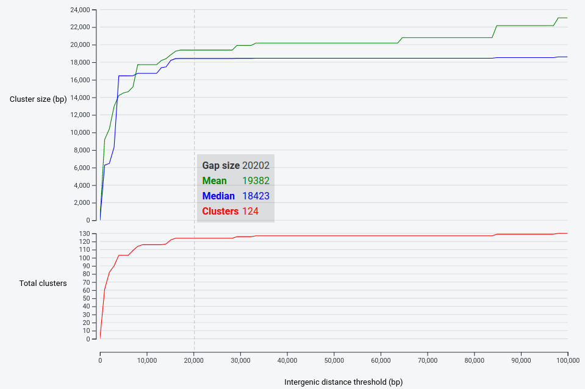

Estimating genomic neighbourhood with the ``gne`` module
========================================================

In ``cblaster``, the most important parameter when detecting hit clusters is the maximum inter-hit gap parameter.
This determines how far ``cblaster`` will look between any two hits before terminating a given cluster.
By default, this parameter is set to 20,000 bp; if no new hit is found within 20,000 bp of the previous hit in a cluster, ``cblaster`` will terminate extension of that cluster, check the other clustering parameters to see if it should save or discard it, before beginning a new cluster starting with the next hit that is found on the genomic scaffold.
Though this number has worked quite well for us when looking at fungi or bacteria, where gene density within clusters is quite high, it may not work for you and your dataset.
For example, plant gene clusters may have key biosynthetic genes spread out over large stretches of the chromosome, with many genes in between; this is where the ``gne`` module comes in.

The ``gne`` module lets you robustly detect an appropriate value to use for this parameter by continually re-running cluster detection on a saved search session at different ``gap`` values over some interval.
It then generates plots of the mean and median cluster sizes (bp), as well as the total number of predicted clusters, at each value.
For example, running ``gne`` on a search session like so:

::

  $ cblaster gne session.json

Will generate output that looks like:

In this example, it becomes apparent that 20 Kbp may be slightly too strict: ``cblaster`` has detected 124 clusters, but raising the threshold to above 34 Kbp results in 3 additional clusters, a number which then does not change until the threshold is substantially larger.
Of course, you would not know without inspecting the actual results if this has been useful or not.
The other insight that can be gleamed from these results is an estimate of the size of the given genomic neighbourhood of your query proteins -- the result clusters in this case tend to be just under 20Kbp.

The ``gne`` module generates a list of ``gap`` values (total number determined by the ``samples`` parameter) from 0 to some upper limit (determined by the ``max_gap`` parameter).
These numbers can be chosen in two ways.
By default, ``gne`` will take evenly spaced (i.e. linear) values over the range 0-100,000 bp.
Alternatively, you can choose to generate these values via a log scale, which will result in more samples at lower values than at higher ones.
This can be specified using the ``--scale`` argument:

::

        $ cblaster gne session.json --scale log

As these plots typically resemble logarithmic growth (i.e. rise steeply, then level off), it can make sense to sample more heavily in the more unstable region of the curve.

In case you would like the underlying data (e.g. for creating your own plots), ``gne`` can generate delimited output.
To do this, simply use the ``-o/--output`` argument to specify a file to save the data to, and the ``-d/--delimiter`` argument to specify the delimiting character.
For example, to generate a CSV file:

::

        $ cblaster gne session.json --output gne.csv --delimiter ","

Like plots generated by the ``search`` module, ``gne`` plots can be saved as static HTML.
To do this, provide a file to the ``-p/--plot`` argument:

::

        $ cblaster gne session.json -p gne.html
