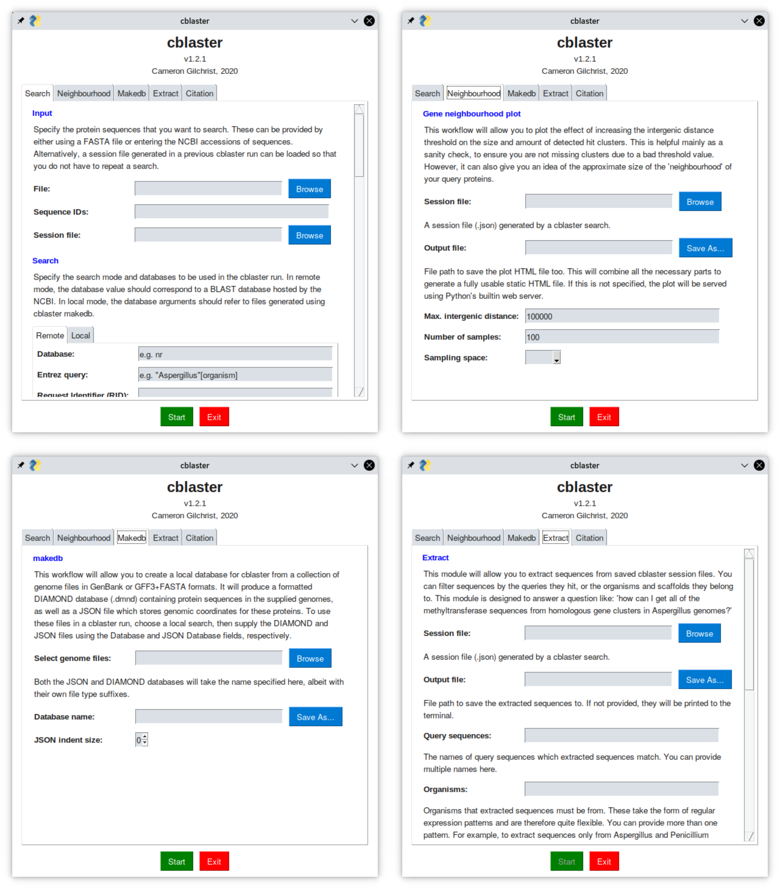

Using the graphical user interface (GUI)
========================================

``cblaster`` provides an easy to use graphical user interface (GUI) which is fully capable of performing all search functionality.
The GUI is implemented using the ``PySimpleGUI`` Python package that is installed alongside ``cblaster`` automatically.
To access the GUI, simply open a terminal and type:

::

	$ cblaster gui

The GUI should then pop up in a new window.
From there, you can run ``cblaster`` searches exactly as you would from the command line.	

