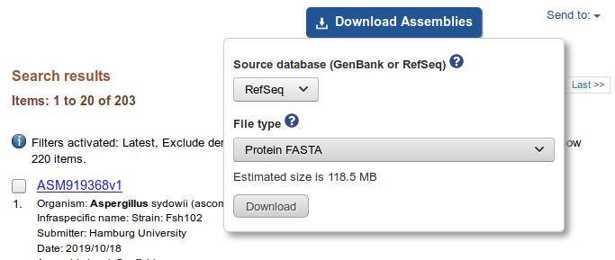

Usage
=====

There are two search modes, specified by the `--mode` argument.
By default (i.e. `--mode` not specified), it will be set to `remote`, and a fully
remote `cblaster` search will begin using NCBI's BLAST API.
Alternatively, `local` mode performs a search against a local `diamond` database, which
is much quicker (albeit requiring some initial setup).


Performing a remote search via the NCBI BLAST API
-------------------------------------------------
At a minimum, a search could look like one of the following:

::

  $ cblaster search -qf query.fasta 
  $ cblaster search -qi QBE85649.1 QBE85648.1 QBE85647.1 QBE85646.1 ...

This will launch a remote search against the non-redundant (nr) protein database,
retrieve and parse the results, then report any blocks of hits to the terminal.
By default, hits are only reported if they are above 30% percent identity and 50% query
coverage, and have an e-value below 0.01.
If we wanted to be stricter, we could change those values with the following:

::

  $ cblaster search -qf query.fasta --min_identity 70 --min_coverage 90 --evalue 0.001

You can also pass in NCBI search queries using `-eq / --entrez_query` to pre-filter
the target database, which can result in vastly reduced run-times and more
targeted results. For example, to only search against *Aspergillus* sequences:

::

  $ cblaster search -qf query.fasta --entrez_query "Aspergillus"[ORGN]

Look here_ for a full description of Entrez search terms.

.. _here: https://www.ncbi.nlm.nih.gov/books/NBK49540/


Searching a local database using DIAMOND
----------------------------------------
Alternatively, a local DIAMOND database can be searched by specifying:

::

  $ cblaster search -qf query.fasta --mode local --database db.dmnd

For this to work, the database must consist of sequences derived from NCBI, such that
their identifiers can be used for retrieval of sequences/genomic context.
The easiest way to set this up is via NCBI's batch assembly download option.
For example, to build a database of *Aspergillus* protein sequences:

1. Search the NCBI Assembly database for *Aspergillus* genomes

.. image:: ./img/search.png
  :width: 500
  :alt: Search for Aspergillus assemblies

2. Click 'Download Assemblies', select 'Protein FASTA' and click 'Download'



3. Extract all FASTA files and concatenate them

::
  
  $ pigz -d *.gz
  $ cat *.faa >> proteins.faa

4. Build the DIAMOND database

::

  $ diamond makedb --in proteins.faa --db proteins
  ...
  $ ls
  database.faa
  database.dmnd
  ```

5. Run `clusterblaster` against the newly created databse

::

  $ cblaster search -m local -qf query.fa -db database.dmnd <options>

Alternatively, you could use `ncbi-genome-download`_ to retrieve the sequences from
the command line.

.. _`ncbi-genome-download`: https://github.com/kblin/ncbi-genome-download


Performing a fully local search
-------------------------------
`cblaster` can also perform fully local searches, forgoing the need for any interaction
with NCBI whatsoever.
To do this, `cblaster` builds a faux-database JSON file from a list of GenBank files,
and generates a `diamond` database of all protein sequences in this database.
Then, `cblaster` searches can be run against the created `diamond` database, and genomic
context obtained from the JSON file.
For example:

1. Build `diamond` and JSON databases

::

  $ cblaster makedb path/to/folder/*.gbk mydatabase
  [12:06:32] INFO - Parsing 3 files...
  [12:06:32] INFO - 1. /path/to/folder/one.gbk
  [12:06:33] INFO - 2. /path/to/folder/two.gbk
  [12:06:34] INFO - 3. /path/to/folder/three.gbk
  [12:07:21] INFO - Writing FASTA file with database sequences: mydatabase.faa
  [12:07:21] INFO - Building DIAMOND database: mydatabase.dmnd
  [12:07:36] INFO - Building JSON database: mydatabase.json

Now, everything should be in the folder:

::

  $ ls
  mydatabase.faa
  mydatabase.dmnd
  mydatabase.json

Note that although this produces a FASTA file with all protein sequences in the
database, the file is NOT actually required for searches. It is merely created for
the purpose of building the `diamond` database, and can easily be recreated by loading
the JSON database in code as a `database.DB` instance and running `write_fasta()` on an
open file handle.

2. Run a `cblaster` search against the built databases

::

  $ cblaster search -qf query.fasta --json mydatabase.json -db mydatabase.db <options>
